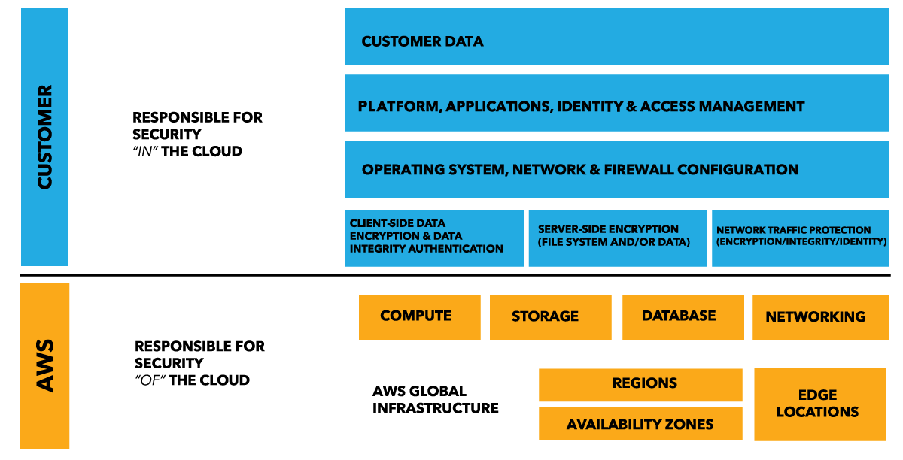
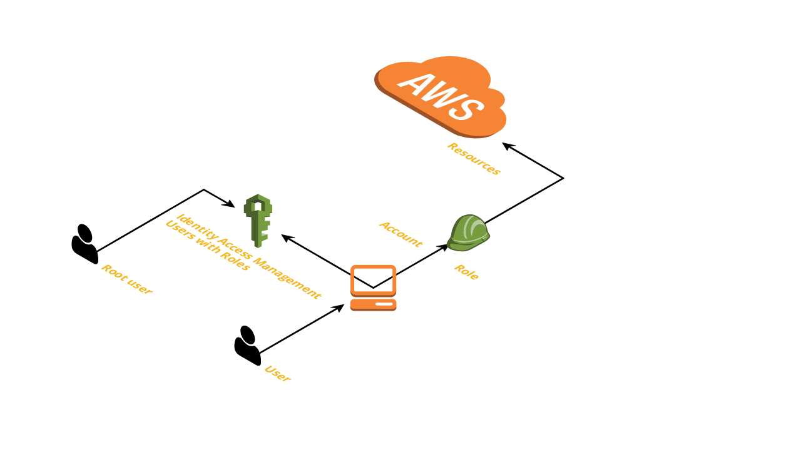
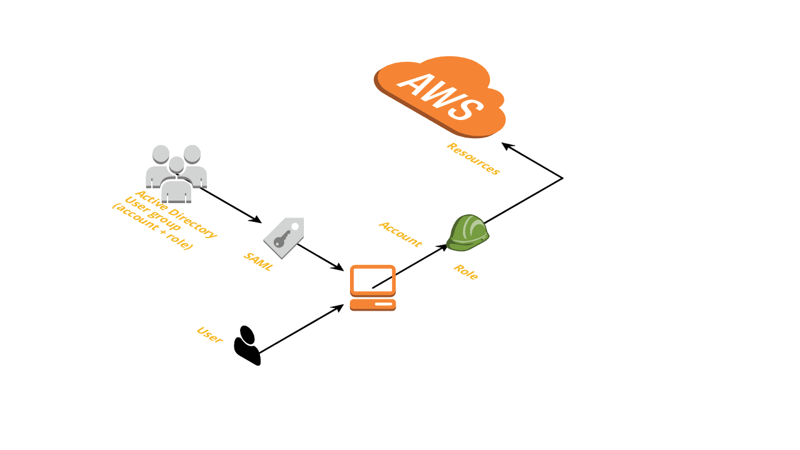

---

layout: default
permalink: aws0.html
style: |

    #Cover h2 {
        margin:30px 0 0;
        color:#FFF;
        text-align:center;
        font-size:70px;
        }
    #Cover p {
        margin:10px 0 0;
        text-align:center;
        color:#FFF;
        font-style:italic;
        font-size:20px;
        }
        #Cover p a {
            color:#FFF;
            }
    #Picture h2 {
        color:#FFF;
        }
    #SeeMore h2 {
        font-size:100px
        }
    #SeeMore img {
        width:0.72em;
        height:0.72em;
        }
---

# AWS 0.Start! {#Cover}

*[David Kubec@vsechnovcloudu](https://vsechnovcloudu.github.io/website/) + [Jekyller](https://github.com/shower/jekyller)*
{:.cover .h}

## AWS Business model

## Nový účet {#newaccount}

1. Postačí kreditní karta, později přejít na fakturaci služeb. Založení trvá pár dní.
2. Tři neproplacené faktury = uzamčení účtu (infrastruktura nezmizí, jen je nepřístupná).
3. První účet obvykle slouží k centralizovanému billingu a jako zakladatel **Organizace**.
4. Výchozí uživatel je **root**.

{:.note}
[AWS Webconsole](https://aws.amazon.com/)

## Ochrana root účtu {#rootaccount}

1. MFA jako naprosté minimum od začátku.
2. Vyloučení root uživatele z běžného používání. Hlavní využití je pro billing či jako "záchranná brzda".
3. Vytvoření prvních rolí a prvních uživatelů.

## Automatická tvorba účtů {#accountautomation}

Další účty jsou členy výchozí **Organizace**. Jejich útrata se posílá nadřazenému účtu.   
Je možné přijímat cizí účty do **Organizace** a je možné i **Organizaci** opustit.
Každý účet může mít svůj vlastní billing limit.

## Sdílený model zodpovědnosti {#sharedresponsibility}

## Minimize impact area

1. Account level
- nejvyšší pohodlnost i izolace
2. Network level
- VPC pro každý produkt
- více práce se síťovou správou
3. Shared account / VPC
- nejjednodušší na začátek
- izolace instancí pouze pomocí *Security Groups*

## Support plan

|             | Customer Service           |                        | Cena       |
+-------------|----------------------------|------------------------|------------+
|* Basic     *| Odpověď do 24 hodin        | Dokumentace, fóra      | zdarma     |
|* Developer *| Architectural support      | Odpověď do 12 hodin    | $29+ měsíc |
|* Business  *| Support API                | Prod.support do 60 min | $100+ měsíc|
|* Enterprise*| Crit.support do 15 min     | Kontrola architektury  | $15k+ měsíc|

{:.note}
[AWS Support plan](https://console.aws.amazon.com/support/plans/home?#/)

## Soft limits

## User management
{:.h}

## Integration with existing AD

